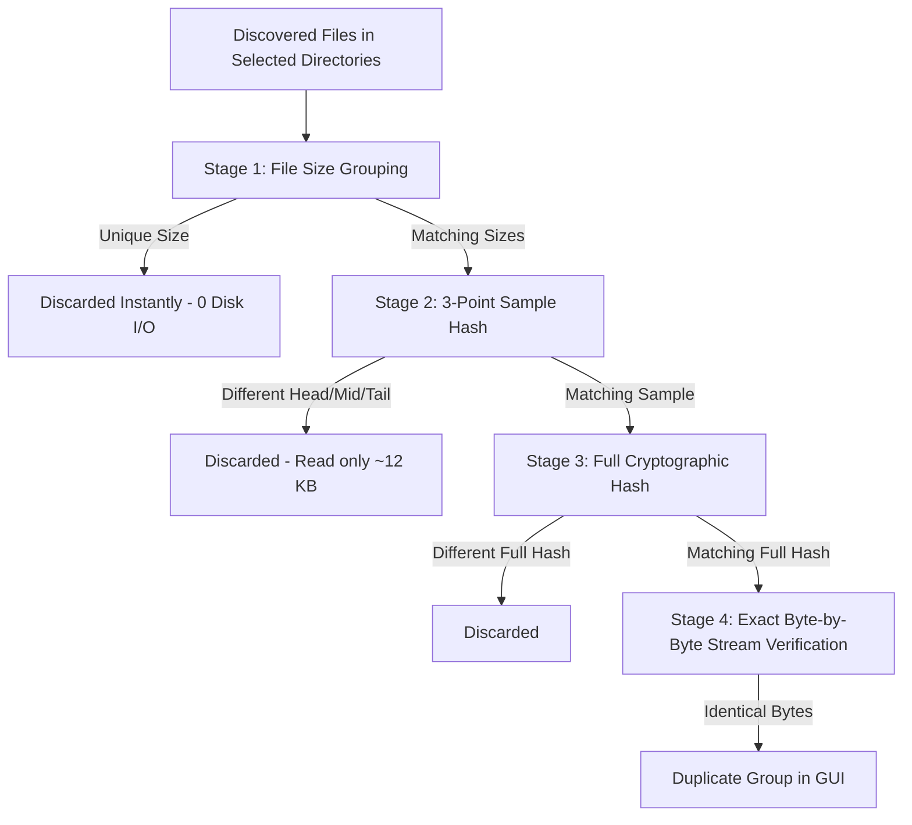

# DuoPty — Implementation & Verification Walkthrough
## Phase 1: Initial System Build

**DuoPty** was built from the ground up to provide an intelligent, multi-tiered duplicate file finder with a modern desktop GUI, safe deletion to the Windows Recycle Bin, and progressive elimination tools.

---

## 🛠️ Components Built

| Component | File | Description |
|---|---|---|
| **Data Models** | `duopty/models.py` | Data classes for `FileInfo`, `DuplicateGroup`, `ScanConfig`, `ScanProgress`, and `ScanStats`. |
| **Progressive Scanner Engine** | `duopty/scanner.py` | 4-stage progressive filtering pipeline (Size grouping ➔ 3-point sample hashing ➔ Full cryptographic hashing ➔ Byte-by-byte binary stream check). |
| **Safe File Deleter** | `duopty/deleter.py` | Native Windows Recycle Bin integration (`SHFileOperationW` Shell API), permanent deletion fallback, and duplicate group safety validation. |
| **Theme & Styles** | `duopty/theme.py` | Modern dark palette, high-contrast treeview tags, custom button styles, and High-DPI support. |
| **Formatting Helpers** | `duopty/utils.py` | File size formatting and platform utility helpers. |
| **Modern Desktop GUI** | `duopty/gui.py` | Full-featured Tkinter/ttk interface with live progress bar, pause/resume/cancel, checkbox treeview, smart selection helpers, context menus, and CSV/JSON export. |
| **Application Launcher** | `main.py` | Main entry point supporting both graphical startup and command-line arguments (`python main.py folder1 folder2 --mode cross_dir`). |
| **Test Suite** | `tests/` | Unit tests covering all tiers, cross-folder comparison, deletion safety, and GUI interaction. |

---

## 🚀 Progressive Elimination Pipeline

To address the requirement: *"Use all the common and uncommon tools to check files are identical. Only use the ones that are required, don't use them all if they are not needed."*



1. **Stage 1 (File Size Filter)**: Queries `os.stat().st_size`. Unique sizes are eliminated immediately without opening any file.
2. **Stage 2 (Sample / Partial Hash)**: Reads only 3 small 4 KB blocks (header, middle, footer). Eliminates non-identical media or archive files without reading gigabytes of data.
3. **Stage 3 (Full Cryptographic Hash)**: Reads remaining candidates in 64 KB chunks using SHA-256, BLAKE2b, MD5, or SHA-1.
4. **Stage 4 (Byte-by-Byte Stream Comparison)**: Pairs surviving candidates and streams binary data block-by-block (`b1 == b2`), guaranteeing absolute 100% mathematical certainty beyond theoretical hash collisions.

---

## 🧪 Verification & Test Results

The initial system was verified using automated tests:

```bash
python -m unittest discover tests
```

### Key Test Scenarios Verified:
- **`test_identical_files_detected_single_folder`**: Verifies exact duplicates within a single directory are identified.
- **`test_different_sizes_eliminated_early`**: Verifies Stage 1 eliminates unique files with 0 disk read.
- **`test_same_size_different_sample_eliminated`**: Verifies Stage 2 eliminates files with matching sizes but different headers.
- **`test_same_sample_different_body_eliminated_in_full_hash`**: Verifies Stage 3 catches files with identical 4 KB headers and footers but differing middle content.
- **`test_cross_directory_comparison`**: Verifies cross-folder mode (Folder 1 vs Folder 2), ignoring internal duplicates in Folder 1 and isolating files in Folder 2 that exist in Folder 1.
- **`test_filter_min_size`**: Verifies 0-byte / empty file filtering.
- **`test_extension_filter`**: Verifies inclusion / exclusion of file types.
- **`test_group_safety_all_selected`**: Verifies safety guard detects when all copies in a group are selected.
- **`test_recycle_bin_delete`**: Verifies Windows Shell API sends files to the Windows Recycle Bin safely.
- **`test_gui_scan_and_smart_select`**: Headless integration test validating scan execution, Treeview population, and smart selection rules ("Keep Oldest", "Keep Newest", "Keep First", "Select All").

---

## 🖥️ How to Run

Launch the application directly from the project directory:

```powershell
python main.py
```

Or pass directories via command line:
```powershell
python main.py "D:\Photos" "E:\BackupPhotos" --mode cross_dir
```
